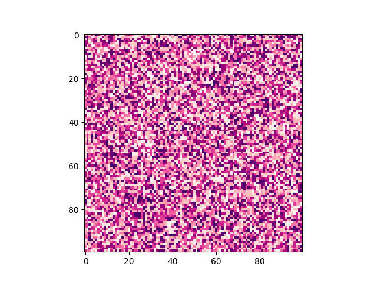
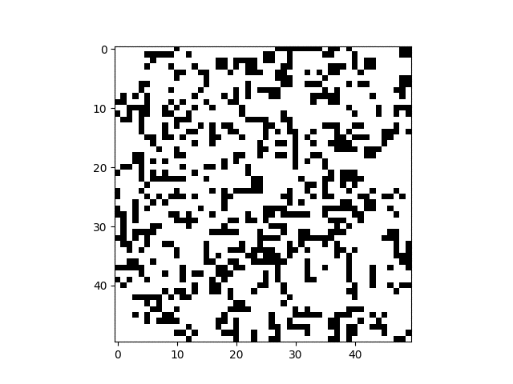
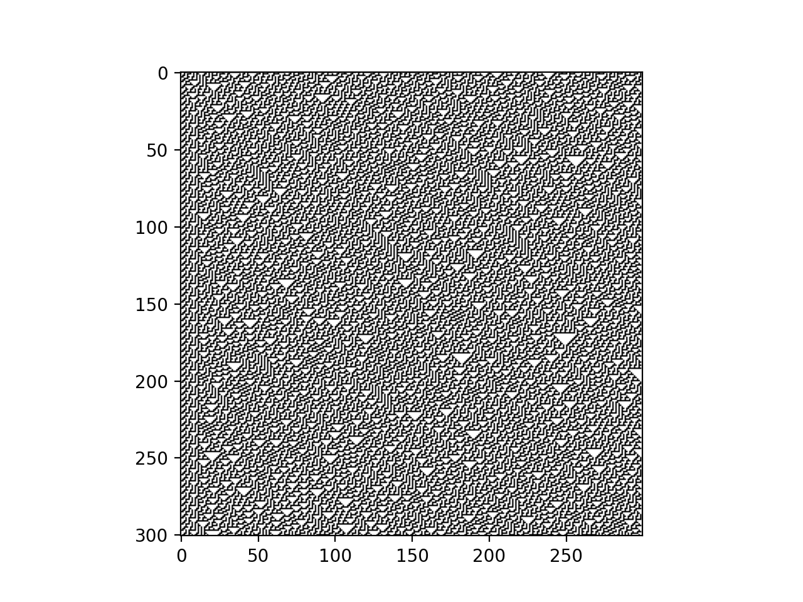
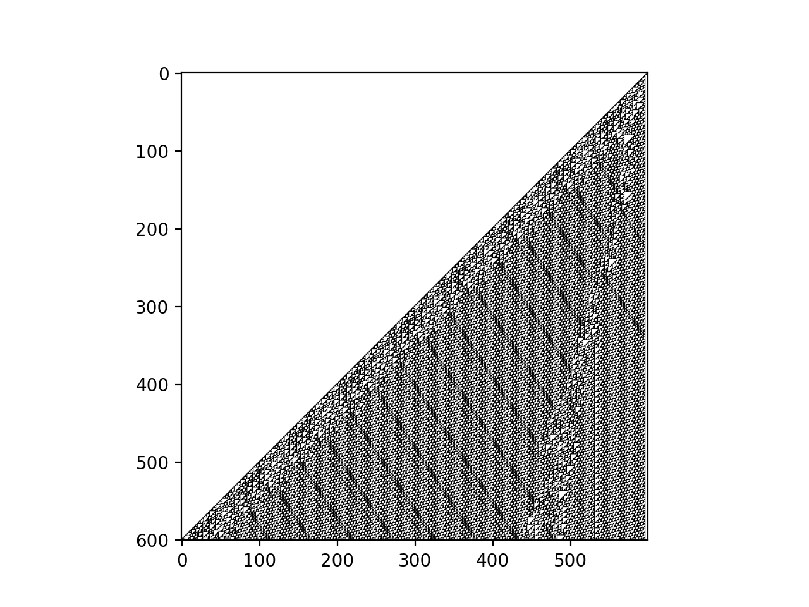
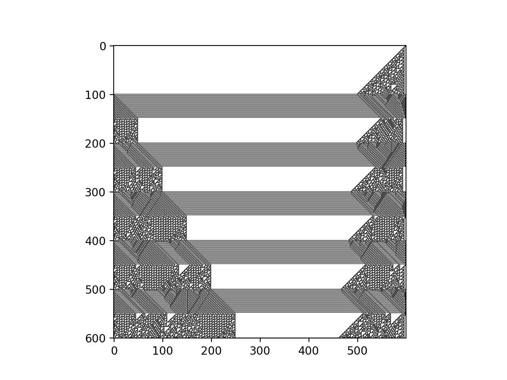

# pyca

[](https://travis-ci.com/wangzhe3224/pyca)

Cellular Automata, CA, in Python.

## Features

- easy to add new rules, check Rule30
- you can even witch rules during compute
- multiple dimensions universes (1d and 2d) support
- support multiply cell types in one universe
- support customized neighbour search 
- unit tests (more is coming)

## Get started
### See something running
1. Clone the code
2. Install libraries: `pip install -r requirements.txt`
3. Pick a script form `example/` folder
4. Magic...
### Explore the code
```python
from pyca.universe1d import Universe1D
from pyca.rules.Rules import Rule30
from pyca.observer import plot1d_universe

universe = Universe1D(300)
universe.register_cell_type(Rule30, 'random', prob=0.5)
universe.initialize()
universe.compute(300)
plot1d_universe(universe)
```

Or for classic rulexxx system, you can just pus a str represent rule for ClassicRule!

```python
from pyca.universe1d import Universe1D
from pyca.rules.BaseRule import ClassicRule
from pyca.observer import plot1d_universe

size = 600
universe = Universe1D(size)
universe.register_cell_type(ClassicRule, 'single', pos=size-1, rule='01101110')  # Rule110 here
universe.initialize()
universe.compute(size)
plot1d_universe(universe)
```

## Concepts

- Universe, contains all the cells, and function to trigger computation
- CellType, rule of the cell is defined here
- observer, way to observe universe, well it can be visual, but it can also be something else, like sounds!

Currently, 2 2D universe is supported, you can define a CA by injecting a 
new type of CellType. 

## Road map

- [ ] 3D universe
- [ ] HyperGraph Universe
- [ ] Interactive Observers
- [ ] Musical Observers

## Examples:

### 2D Cyclic AC

http://psoup.math.wisc.edu/mcell/rullex_cycl.html

[code](./example/2dCyclicAC.py)



### Game of Life

https://en.wikipedia.org/wiki/Conway%27s_Game_of_Life

[Code](./example/game_of_life.py)



### Rule30

https://en.wikipedia.org/wiki/Rule_30

[Code](./example/rule30.py)



### Rule 110

https://en.wikipedia.org/wiki/Rule_110

[Code](./example/rule110.py)



### Switch rules

[Code](./example/switch_rules.py)




## Related projects

- [Cellular-Automaton-Viewer](https://github.com/jedlimlx/Cellular-Automaton-Viewer)
- [cellularAutomata, Haskell version](https://github.com/bollu/cellularAutomata)
- [A CA Game](https://sandspiel.club/)